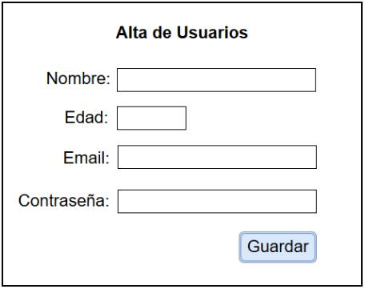
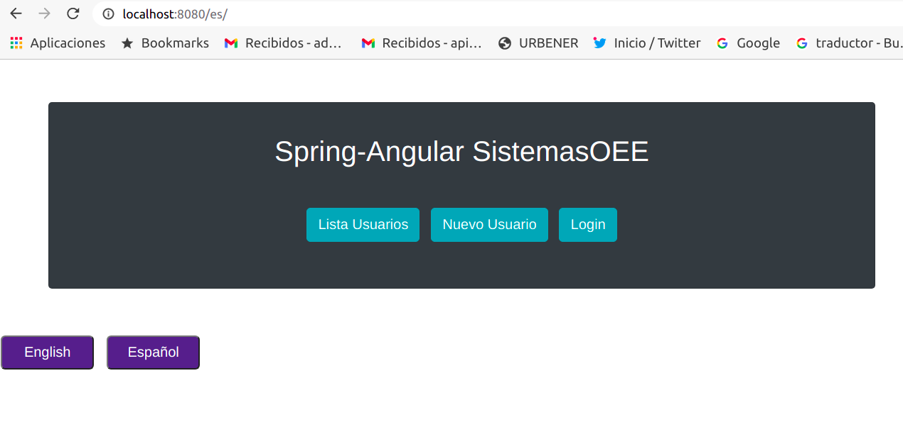
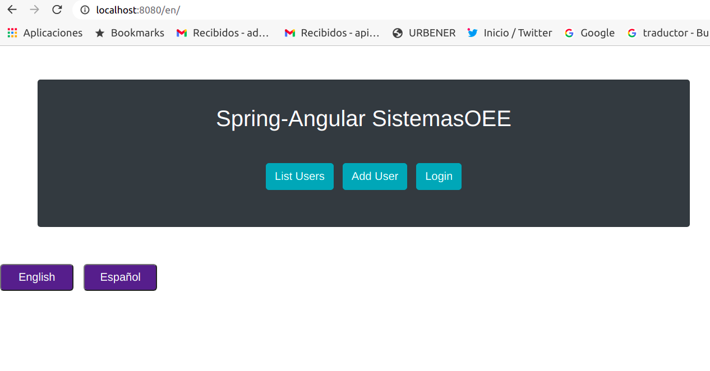
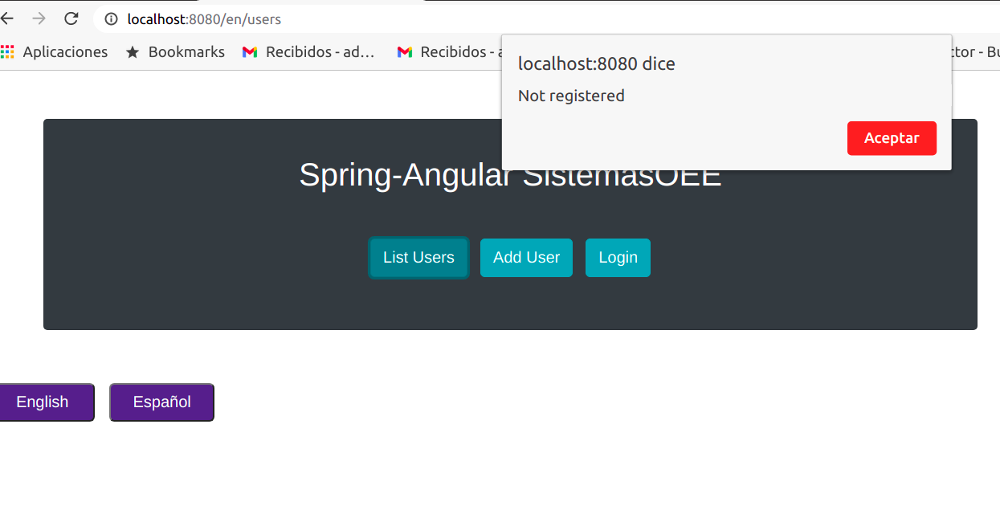
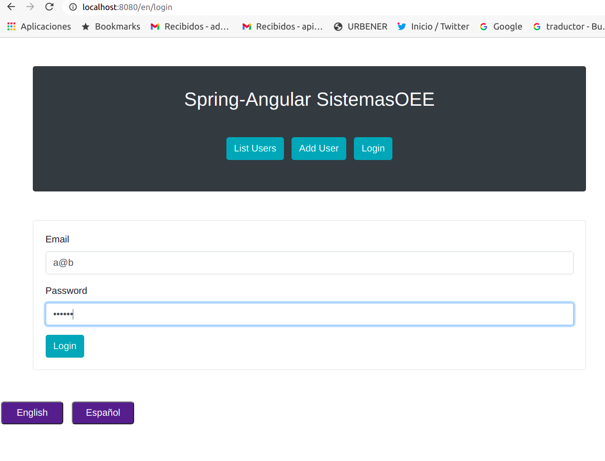
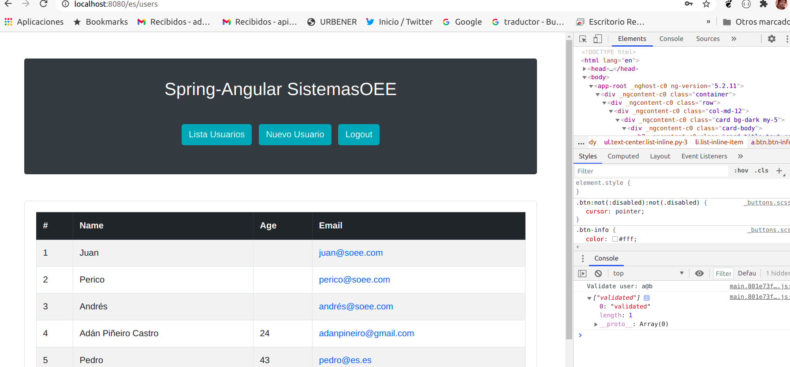

### Práctica programación Spring-AngularJS
>Autor: Adán Piñeiro [adanpineiro@gmail.com]

La práctica propuesta consiste en realizar una aplicación web de tres pantallas:
1. Alta de Usuarios
2. Ventana de autenticación
3. Listado de Usuarios dados de alta

#### Alta de usuarios
Consiste en la creación de nuevos usuarios de la aplicación. Es una pantalla muy sencilla que sólo incluirá cuatro campos.
Podemos ver un ejemplo en la imagen inferior:



La aplicación tendrá dos opciones para el almacenamiento de los usuarios:
1. Persistente: Los usuarios se almacenarán en una base de datos, en archivo o en cualquier otra solución de
persistencia que se elija.
2. Volátil: Los usuarios serán almacenados en memoria (ejemplo, sesión).

Para poder seleccionar el modo de almacenamiento, se dispondrá de una variable de configuración, es decir, la aplicación
trabaja de un modo o de otro. No utilizará los dos de forma simultánea.

#### Ventana de autenticación
Esta es la típica ventana de email-contraseña en la que el usuario se puede autenticar. Validará las credenciales
introducidas por el usuario, mostrando los mensajes oportunos de error (las credenciales no son correctas, no se ha
indicado el campo de email o es incorrecto su formato y no se ha indicado el campo de contraseña).

Si la validación es correcta, se mostrará la ventana de Listado de Usuarios.

#### Listado de Usuarios
El listado de usuarios es una pantalla en la que se listan los usuarios dados de alta para comprobar que todo funciona
correctamente.

Se deberá proporcionar un sistema (menú o simples enlaces) para poder navegar entre las distintas ventanas.

### Tecnologías
- Back-end: Java con Spring. Spring.
- Front-end: Se desarrollará en Angular, HTML, css y Bootstrap.

### Entrega
- Se entregará en un repositorio Github, Gitlab o Bitbucket:


# Desarrollo de la práctica
Para el Back-End se emplea Spring Boot como motor de un sencillo REST-API, para el Front-end Angular, HTML, css y Bootstrap.

## Back-End Spring
Para el Back-End se emplea Spring Boot como motor de un sencillo REST-API

### Maven
Se emplea [maven](https://maven.apache.org/) como herramienta de gestión y construcción del proyecto java.
El fichero pom.xml se adjunta a continuación:

``` [xml]
<?xml version="1.0" encoding="UTF-8"?>
<project xmlns="http://maven.apache.org/POM/4.0.0"
	xmlns:xsi="http://www.w3.org/2001/XMLSchema-instance"
	xsi:schemaLocation="http://maven.apache.org/POM/4.0.0 http://maven.apache.org/xsd/maven-4.0.0.xsd">
	<modelVersion>4.0.0</modelVersion>

	<groupId>com.sistemasoee.spring-angular</groupId>
	<artifactId>spring-angular</artifactId>
	<version>1.0</version>
	<packaging>jar</packaging>

	<name>spring-angular</name>


	<properties>
		<project.build.sourceEncoding>UTF-8</project.build.sourceEncoding>
		<spring.version>2.4.2</spring.version>
		<h2.version>1.4.200</h2.version>
	</properties>

	<dependencies>
		<dependency>
			<groupId>org.springframework.boot</groupId>
			<artifactId>spring-boot-starter-data-jpa</artifactId>
			<version>${spring.version}</version>
		</dependency>
		<dependency>
			<groupId>org.springframework.boot</groupId>
			<artifactId>spring-boot-starter-web</artifactId>
			<version>${spring.version}</version>
		</dependency>
		<dependency>
			<groupId>org.springframework.boot</groupId>
			<artifactId>spring-boot-starter-validation</artifactId>
			<version>${spring.version}</version>
		</dependency>
		<dependency>
			<groupId>com.h2database</groupId>
			<artifactId>h2</artifactId>
			<version>${h2.version}</version>
			<scope>runtime</scope>
		</dependency>
		<dependency>
			<groupId>org.springframework.boot</groupId>
			<artifactId>spring-boot-starter-test</artifactId>
			<version>${spring.version}</version>
			<scope>test</scope>
		</dependency>
	</dependencies>

	<build>
		<plugins>
			<plugin>
				<artifactId>maven-compiler-plugin</artifactId>
				<version>3.1</version>
				<configuration>
					<source>1.8</source>
					<target>1.8</target>
				</configuration>
			</plugin>

			<plugin>
				<groupId>org.springframework.boot</groupId>
				<artifactId>spring-boot-maven-plugin</artifactId>
				<version>${spring.version}</version>
			</plugin>
		</plugins>
	</build>

</project>
```

### Ficheros

La estructura del proyecto es la siguiente:
<pre>
|____src
| |____main
| | |____resources
| | | |____application.properties
| | |____java
| | | |____com
| | | | |____sistemasoee
| | | | | |____app
| | | | | | |____controllers
| | | | | | | |____UserController.java
| | | | | | |____repositories
| | | | | | | |____CustomUserRepository.java
| | | | | | | |____UserRepository.java
| | | | | | |____Application.java
| | | | | | |____entities
| | | | | | | |____User.java
</pre>

Las clases java están documentadas en el propio código. Se ha generado javadoc asociado en  __apidocs__ .

Se emplea persistencia JPA con base de datos H2 bien en memoria, bien en fichero. PAra seleccionar un modo u otro se debe ajustar en el fichero  __src/main/resources/application.properties__  o bien mediante argumentos al plugin  __mvn spring-boot:run__ .

**src/main/resources/application.properties**

```
server.port=8081
logging.file.name=soee.log

spring.datasource.driver-class-name=org.h2.Driver
spring.jpa.hibernate.ddl-auto=update
# BdD en memoria, volátil se elimina al cerrar la VM de java
#spring.datasource.url=jdbc:h2:mem:soee;DB_CLOSE_DELAY=-1
# BdD local H2 en fichero soee desde directorio de lanzamiento [en principio al mismo nivel que pom.xml si se hace con mvn spring-boot:run]
spring.datasource.url=jdbc:h2:./soee;DB_CLOSE_DELAY=-1
spring.datasource.username=sa
spring.datasource.password=

spring.jpa.hibernate.use-new-id-generator-mappings=false
```

El listado completo de las propiedades que se pueden ajustar está en:[https://docs.spring.io/spring-boot/docs/current/reference/html/appendix-application-properties.html](https://docs.spring.io/spring-boot/docs/current/reference/html/appendix-application-properties.html).


### Traza
Se ha activado el sistema de traza slf4j. Se puede ajustar por ejemplo como argumento al plugin spring-boot:run, más adelante se detalla.

El fichero de traza contiene información del tipo:

```
2021-02-19 13:10:37.262  INFO 35184 --- [main] com.sistemasoee.app.Application          : Started Application in 1.945 seconds (JVM running for 2.162)
2021-02-19 13:10:53.829  INFO 35184 --- [http-nio-8081-exec-1] o.a.c.c.C.[Tomcat].[localhost].[/]       : Initializing Spring DispatcherServlet 'dispatcherServlet'
2021-02-19 13:10:53.829  INFO 35184 --- [http-nio-8081-exec-1] o.s.web.servlet.DispatcherServlet        : Initializing Servlet 'dispatcherServlet'
2021-02-19 13:10:53.830  INFO 35184 --- [http-nio-8081-exec-1] o.s.web.servlet.DispatcherServlet        : Completed initialization in 1 ms
2021-02-19 13:10:53.891 DEBUG 35184 --- [http-nio-8081-exec-1] c.s.app.controllers.UserController       : Validate user: User{id=0, name=, email=adanpineiro@gmail.com, md5=c893bad68927b457dbed39460e6afd62}:password incorrect
2021-02-19 13:11:17.082  INFO 35184 --- [http-nio-8081-exec-3] c.s.app.controllers.UserController       : new user: User{id=7, name=grge, email=a@b, md5=c893bad68927b457dbed39460e6afd62}
2021-02-19 13:11:32.185 DEBUG 35184 --- [http-nio-8081-exec-5] c.s.app.controllers.UserController       : Validate user: User{id=0, name=, email=a@b, md5=c893bad68927b457dbed39460e6afd62}:validated
2021-02-19 14:12:07.719 DEBUG 35184 --- [http-nio-8081-exec-9] c.s.app.controllers.UserController       : Validate user: User{id=0, name=, email=a@b, md5=c893bad68927b457dbed39460e6afd62}:validated
2021-02-19 16:57:28.110  INFO 35184 --- [http-nio-8081-exec-3] c.s.app.controllers.UserController       : new user: User{id=8, name=ana, email=acastiella@gmail.com, md5=c893bad68927b457dbed39460e6afd62}
2021-02-19 16:59:03.787 DEBUG 35184 --- [http-nio-8081-exec-7] c.s.app.controllers.UserController       : Validate user: User{id=0, name=, email=adanpineiro@gmail.com, md5=73c18c59a39b18382081ec00bb456d43}:password incorrect
2021-02-19 17:00:00.027 DEBUG 35184 --- [http-nio-8081-exec-8] c.s.app.controllers.UserController       : Validate user: User{id=0, name=, email=acastiella@gmail.com, md5=c893bad68927b457dbed39460e6afd62}:validated
```

### md5 password
En el controlador, las contraseñas se almacenan el hash md5 en lugar de la propia contraseña, por privacidad.

### Lanzamiento Spring Boot

**posibles argumentos**

```
# ejemplo 1: lanzar back-end desde: ~/spring-angular
mvn spring-boot:run 

# ejemplo 2: lanzar con argumentos, prevalecen sobre el contenido de application.properties
mvn spring-boot:run -Dspring-boot.run.arguments="--initbd --logging.level.com.sistemasoee=DEBUG --spring.datasource.url=jdbc:h2:mem:soee;DB_CLOSE_DELAY=-1" 
```
Se ha creado un argumento específico para poblar la base de datos inicial con algunos usuarios:  __--initbd__  

En el ejemplo 2 se pide iniciar la base de datos, ajustar el nivel de traza del paquete com.soee a DEBUG y emplear una base de datos H2 en memoria (volátil).

Una vez lanzado el servidor se encuentra en http://localhost:8081.

La consola de salida será algo como:

```
[INFO] --- spring-boot-maven-plugin:2.4.2:run (default-cli) @ spring-angular ---
[INFO] Attaching agents: []
17:25:24.169 [main] DEBUG com.sistemasoee.app.Application - 0:--logging.level.com.sistemasoee=DEBUG

  .   ____          _            __ _ _
 /\\ / ___'_ __ _ _(_)_ __  __ _ \ \ \ \
( ( )\___ | '_ | '_| | '_ \/ _` | \ \ \ \
 \\/  ___)| |_)| | | | | || (_| |  ) ) ) )
  '  |____| .__|_| |_|_| |_\__, | / / / /
 =========|_|==============|___/=/_/_/_/
 :: Spring Boot ::                (v2.4.2)

2021-02-19 17:25:24.499  INFO 46693 --- [           main] com.sistemasoee.app.Application          : Starting Application using Java 1.8.0_261 on adan-Vostro-5590 with PID 46693 (/home/adan/java/soee/spring-angular/target/classes started by adan in /home/adan/java/soee/spring-angular)
2021-02-19 17:25:24.500 DEBUG 46693 --- [           main] com.sistemasoee.app.Application          : Running with Spring Boot v2.4.2, Spring v5.3.3
2021-02-19 17:25:24.501  INFO 46693 --- [           main] com.sistemasoee.app.Application          : No active profile set, falling back to default profiles: default
2021-02-19 17:25:24.908  INFO 46693 --- [           main] .s.d.r.c.RepositoryConfigurationDelegate : Bootstrapping Spring Data JPA repositories in DEFAULT mode.
2021-02-19 17:25:24.934  INFO 46693 --- [           main] .s.d.r.c.RepositoryConfigurationDelegate : Finished Spring Data repository scanning in 20 ms. Found 1 JPA repository interfaces.
2021-02-19 17:25:25.214  INFO 46693 --- [           main] o.s.b.w.embedded.tomcat.TomcatWebServer  : Tomcat initialized with port(s): 8081 (http)
2021-02-19 17:25:25.220  INFO 46693 --- [           main] o.apache.catalina.core.StandardService   : Starting service [Tomcat]
2021-02-19 17:25:25.220  INFO 46693 --- [           main] org.apache.catalina.core.StandardEngine  : Starting Servlet engine: [Apache Tomcat/9.0.41]
2021-02-19 17:25:25.265  INFO 46693 --- [           main] o.a.c.c.C.[Tomcat].[localhost].[/]       : Initializing Spring embedded WebApplicationContext
2021-02-19 17:25:25.265  INFO 46693 --- [           main] w.s.c.ServletWebServerApplicationContext : Root WebApplicationContext: initialization completed in 729 ms
2021-02-19 17:25:25.353  INFO 46693 --- [           main] o.hibernate.jpa.internal.util.LogHelper  : HHH000204: Processing PersistenceUnitInfo [name: default]
2021-02-19 17:25:25.374  INFO 46693 --- [           main] org.hibernate.Version                    : HHH000412: Hibernate ORM core version 5.4.27.Final
2021-02-19 17:25:25.428  INFO 46693 --- [           main] o.hibernate.annotations.common.Version   : HCANN000001: Hibernate Commons Annotations {5.1.2.Final}
2021-02-19 17:25:25.475  INFO 46693 --- [           main] com.zaxxer.hikari.HikariDataSource       : HikariPool-1 - Starting...
2021-02-19 17:25:25.597  INFO 46693 --- [           main] com.zaxxer.hikari.HikariDataSource       : HikariPool-1 - Start completed.
2021-02-19 17:25:25.607  INFO 46693 --- [           main] org.hibernate.dialect.Dialect            : HHH000400: Using dialect: org.hibernate.dialect.H2Dialect
2021-02-19 17:25:25.912  INFO 46693 --- [           main] o.h.e.t.j.p.i.JtaPlatformInitiator       : HHH000490: Using JtaPlatform implementation: [org.hibernate.engine.transaction.jta.platform.internal.NoJtaPlatform]
2021-02-19 17:25:25.916  INFO 46693 --- [           main] j.LocalContainerEntityManagerFactoryBean : Initialized JPA EntityManagerFactory for persistence unit 'default'
2021-02-19 17:25:26.083  WARN 46693 --- [           main] JpaBaseConfiguration$JpaWebConfiguration : spring.jpa.open-in-view is enabled by default. Therefore, database queries may be performed during view rendering. Explicitly configure spring.jpa.open-in-view to disable this warning
2021-02-19 17:25:26.144  INFO 46693 --- [           main] o.s.s.concurrent.ThreadPoolTaskExecutor  : Initializing ExecutorService 'applicationTaskExecutor'
2021-02-19 17:25:26.264  INFO 46693 --- [           main] o.s.b.w.embedded.tomcat.TomcatWebServer  : Tomcat started on port(s): 8081 (http) with context path ''
2021-02-19 17:25:26.271  INFO 46693 --- [           main] com.sistemasoee.app.Application          : Started Application in 2.0 seconds (JVM running for 2.206)
User{id=1, name=Juan, email=juan@soee.com, md5=null}
User{id=2, name=Perico, email=perico@soee.com, md5=null}
User{id=3, name=Andrés, email=andrés@soee.com, md5=null}
User{id=4, name=Adán Piñeiro Castro, email=adanpineiro@gmail.com, md5=prueba}
User{id=5, name=Pedro, email=pedro@es.es, md5=prueba}
User{id=6, name=prueba, email=adanpineiro@gmail.com, md5=c893bad68927b457dbed39460e6afd62}
User{id=7, name=grge, email=a@b, md5=c893bad68927b457dbed39460e6afd62}
User{id=8, name=ana, email=acastiella@gmail.com, md5=c893bad68927b457dbed39460e6afd62}
```


## Front-End Angular + HTML + css + Bootstrap

Creamos una aplicación simple Angular, para consumir el REST API del controllador Spring anteriormente creado.

Lo haremos desde cero usando *angular cli* , se puede instalar *angular cli* bajo *node js* si no está instalado mediante:

```
npm install -g @angular/cli@1.7.4
```
A continuación es necesario crear la estructura cliente:

```
ng new angularclient
```

Crear el modelo de datos y poner en directorio model:

```
ng generate class user
```

Generar el servicio que consumirá los datos del Back-end:

```
ng generate service user
```

y ponerlo en directorio service.

Crear los componentes de la aplicación:

```
ng generate component user-list
ng generate component user-form
ng generate component user-login
```

La estructura del cliente queda del siguiente modo:
<pre>
| |____app
| | |____app.component.css
| | |____user-list
| | | |____user-list.component.html
| | | |____user-list.component.ts
| | | |____user-list.component.spec.ts
| | | |____user-list.component.css
| | |____model
| | | |____user.ts
| | |____service
| | | |____user.service.spec.ts
| | | |____user.service.ts
| | |____user-form
| | | |____user-form.component.spec.ts
| | | |____user-form.component.css
| | | |____user-form.component.ts
| | | |____user-form.component.html
| | |____app.component.spec.ts
| | |____app.component.html
| | |____app.component.ts
| | |____app.module.ts
| | |____user-login
| | | |____user-login.component.spec.ts
| | | |____user-login.component.html
| | | |____user-login.component.ts
| | | |____user-login.component.css
| | |____app-routing.module.ts
</pre>

En el propio código se comentan algunos aspectos, pero la estructura es el arquetipo definido por angular cli, donde los componentes TS llevan asociado una plantilla HTML y una hoja de estilos CSS.

### Hojas de estilo CSS

Se ha establecido un stylesheet propio a modo de prueba para los botones de selección de idioma en app.component.css

```
.button {  
	background-color: darkslateblue;
	border-radius: 5px;
	color: white;
	padding: 5px;
	width: 10%;
	margin: 5px;
	text-decoration: none;
	cursor: pointer;
	}
```

### i18n
Se incorpora una muestra del sistema de localización de idioma i18n. Para intercambiar idioma, se escribe i18n en las etiquetas html cuyo contenido queramos cambiar, en este caso de muestra los botones del menú principal únicamente a modo de prueba de funcionamiento:

```
ng xi18n --output-path translate
```
Se crea el fichero src/translate/messages.xlf con los tags a traducir, aquellos que están marcados con i18n en la plantilla html, en nuestro ejemplo de prueba sencillo en app.component.html:

```
<a routerLink="/adduser" class="btn btn-info" i18n>Add User</a>
```

**src/translate/messages.xlf**

```
<?xml version="1.0" encoding="UTF-8" ?>
<xliff version="1.2" xmlns="urn:oasis:names:tc:xliff:document:1.2">
  <file source-language="en" datatype="plaintext" original="ng2.template">
    <body>
      <trans-unit id="2fd734f75101371d114e97f8e9b10b65817862b9" datatype="html">
        <source>List Users</source>
        <context-group purpose="location">
          <context context-type="sourcefile">app/app.component.ts</context>
          <context context-type="linenumber">9</context>
        </context-group>
      </trans-unit>
      <trans-unit id="94be6ae6ec1f87bedc67020629343b27fdbece0a" datatype="html">
        <source>Add User</source>
        <context-group purpose="location">
          <context context-type="sourcefile">app/app.component.ts</context>
          <context context-type="linenumber">12</context>
        </context-group>
      </trans-unit>
    </body>
  </file>
</xliff>
```
Hay que cerar un fichero por cada idioma, incorporando las traducciones, por ejemplo para castellano:

**src/translate/messages.es.xlf**

```
<?xml version="1.0" encoding="UTF-8" ?>
<xliff version="1.2" xmlns="urn:oasis:names:tc:xliff:document:1.2">
  <file source-language="en" datatype="plaintext" original="ng2.template">
    <body>
      <trans-unit id="2fd734f75101371d114e97f8e9b10b65817862b9" datatype="html">
        <source>List Users</source>
        <target>Lista Usuarios</target>
        <context-group purpose="location">
          <context context-type="sourcefile">app/app.component.ts</context>
          <context context-type="linenumber">9</context>
        </context-group>
      </trans-unit>
      <trans-unit id="94be6ae6ec1f87bedc67020629343b27fdbece0a" datatype="html">
        <source>Add User</source>
        <target>Nuevo Usuario</target>
        <context-group purpose="location">
          <context context-type="sourcefile">app/app.component.ts</context>
          <context context-type="linenumber">12</context>
        </context-group>
      </trans-unit>
    </body>
  </file>
</xliff>
```

Finalmente es necesario crear dist con diferentes locales seleccionables en aplicación

```
ng build --prod --i18n-locale es --i18n-format xlf --i18n-file src/translate/messages.es.xlf --output-path=dist/es --baseHref /es/
ng build --prod --i18n-locale en --i18n-format xlf --i18n-file src/translate/messages.en.xlf --output-path=dist/en --baseHref /en/
```

Para lanzar el Front-end angular js bajo node js para desarrollo:

```
spring-angular/angularclient$ ng serve --open
```

Añadiento **--open** abre navegador apuntando a http://localhost:4200/ para probar el desarrollo (salvo la parte de i18n que hay que probar en producción)

Es necesario lanzar un servidor de pruebas para probar en producción con los diferentes locales:

```
http-server ./dist
```

si no está instalado, instalarlo globalmente con "npm install http-server -g"

conectar a http://localhost:8080/es/ para probar la aplicación de producción:


### Pantallas de muestra

#### Pantalla inicial español:



#### Pantalla inicial inglés:



#### Listar usuarios sin estar registrado en el sistema


#### Login usuario registrado en el sistema 


#### Validación usuario exitosa + mensaje en consola + Lista usuarios




## TODO

Se han quedado varias cosas en el tintero: securizar Back-end y Front-end, configurar y ejecutar los Tests, realizar validaciones de la información suministrada por el usuario, etc.

Pero como primera aproximación creo que es suficiente.


